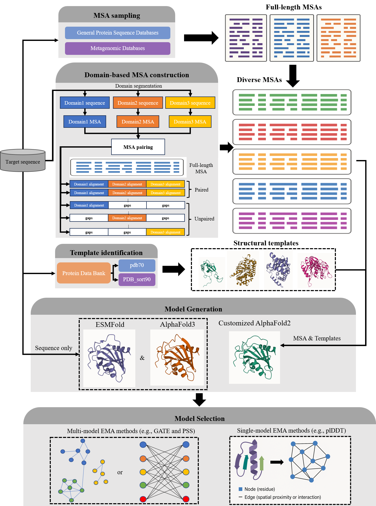

# **MULTICOM4 protein structure prediction system**

MULTICOM4 is an advanced protein structure prediction system built on AlphaFold2 and 3. It achieved remarkable success in the 16th world-wide Critical Assessment of Techniques for Protein Structure Prediction (CASP16) concluded in December 2024, ranking 1st in protein complex structure prediction without stoichiometry information (Phase 0), 2nd in protein tertiary structure prediction, 2nd in estimating the global fold accuracy of protein complex structures, 3rd in protein complex structure prediction with stoichiometry information (Phase 1), and 5th in protein-ligand structure and binding affinity prediction.

# **Some CASP16 Prediction Examples**

**Colored Chains**: Model predicted by MULTICOM4  
**Brown**: True structure 

| **Target ID** | **Description**                                | **Visualization**              |
| ------------- | ---------------------------------------------- | ------------------------------- |
| **H0215**     | A1B1, mNeonGreen with Bound Nanobody           |        |
| **H0233**     | A2B2C2, Antibody Fab 3H4 complex, virus capsid |        |
| **H0245**     | A1B1, FUNComplex, Shallow MSA                  |        |
| **T0234o**    | A3, Better Stoichiometry Prediction            |        |


## **The workflow of the MULTICOM4 protein complex structure prediction system used in CASP16**


## **The workflow of the MULTICOM4 protein tertiary structure prediction system used in CASP16**




# **Download MULTICOM4 package**

```
git clone --recursive https://github.com/BioinfoMachineLearning/MULTICOM4
```

# **Installation (non Docker version)**

## **Install AlphaFold/AlphaFold-Multimer and other required third-party packages (modified from [alphafold_non_docker](https://github.com/kalininalab/alphafold_non_docker))**

### **Install miniconda**

``` bash
wget https://repo.anaconda.com/miniconda/Miniconda3-latest-Linux-x86_64.sh && bash Miniconda3-latest-Linux-x86_64.sh
```

### **Create a new conda environment and update**

``` bash
conda create --name multicom4 python==3.8
conda update -n base conda
```

### **Activate conda environment**

``` bash
conda activate multicom4
```

### **Install dependencies**

- Change `cudatoolkit==11.2.2` version if it is not supported in your system

``` bash
conda install -y -c conda-forge openmm==7.5.1 cudatoolkit==11.2.2 pdbfixer
conda install -y -c bioconda hmmer hhsuite==3.3.0 kalign2
```

- Change `jaxlib==0.3.25+cuda11.cudnn805` version if this is not supported in your system

``` bash
pip install absl-py==1.0.0 biopython==1.79 chex==0.0.7 dm-haiku==0.0.9 dm-tree==0.1.6 immutabledict==2.0.0 jax==0.3.25 ml-collections==0.1.0 numpy==1.21.6 pandas==1.3.4 protobuf==3.20.1 scipy==1.7.0 tensorflow-cpu==2.9.0

pip install --upgrade --no-cache-dir jax==0.3.25 jaxlib==0.3.25+cuda11.cudnn805 -f https://storage.googleapis.com/jax-releases/jax_cuda_releases.html
```

### **Download chemical properties to the common folder**

``` bash

# Replace $MULTICOM4_INSTALL_DIR with your MULTICOM4 installation directory

wget -q -P $MULTICOM4_INSTALL_DIR/tools/alphafold-v2.3.2/alphafold/common/ https://git.scicore.unibas.ch/schwede/openstructure/-/raw/7102c63615b64735c4941278d92b554ec94415f8/modules/mol/alg/src/stereo_chemical_props.txt
```

### **Apply OpenMM patch**

``` bash
# Replace $MULTICOM4_INSTALL_DIR with your MULTICOM4 installation directory

cd ~/anaconda3/envs/multicom4/lib/python3.8/site-packages/ && patch -p0 < $MULTICOM4_INSTALL_DIR/tools/alphafold-v2.3.2/docker/openmm.patch

# or

cd ~/miniconda3/envs/multicom4/lib/python3.8/site-packages/ && patch -p0 < $MULTICOM4_INSTALL_DIR/tools/alphafold-v2.3.2/docker/openmm.patch
```

### **Install other required third-party packages**

```
conda install tqdm
conda install -c conda-forge -c bioconda foldseek
conda install scikit-learn

#if running jackhmmer returns error: libgsl.so.25: cannot open shared object file: No such file or directory
conda install -c conda-forge gsl=2.5
```

### **Install third-party packages envorinments**

```python
# DHR
mamba env create -f tools/Dense-Homolog-Retrieval/env.yml

# ESMFold
conda env create -f envs/esm.yml
conda activate esmfold
pip install "fair-esm[esmfold]"
pip install 'openfold @ git+https://github.com/aqlaboratory/openfold.git@4b41059694619831a7db195b7e0988fc4ff3a307'
```

### **Download Genetic databases in AlphaFold2/AlphaFold-Multimer**

```
# Replace $MULTICOM4_INSTALL_DIR with your MULTICOM4 installation directory

bash $MULTICOM4_INSTALL_DIR/tools/alphafold-v2.3.2/scripts/download_all_data.sh <YOUR_ALPHAFOLD_DB_DIR>
```

### **Install the MULTICOM4 addon system and its databases**

```python
# Note: here the parameters should be the absolute paths
python download_database_and_tools.py --multicom4db_dir <YOUR_MULTICOM4_DB_DIR>

# Configure the MULTICOM4 system
# Replace $MULTICOM4_INSTALL_DIR with your MULTICOM4 installation directory
# Replace $YOUR_ALPHAFOLD_DB_DIR with your downloaded AlphaFold databases directory

python configure.py --envdir ~/miniconda3/envs/multicom4 --multicom4db_dir <YOUR_MULTICOM4_DB_DIR> --afdb_dir <YOUR_ALPHAFOLD_DB_DIR>

# e.g, 
# python download_database_and_tools.py \
# --multicom4db_dir /home/multicom4/tools/multicom4_db

# python configure.py \
# --multicom4db_dir /home/multicom4/tools/multicom4_db \
# --afdb_dir /home/multicom4/tools/alphafold_databases/
```
The configure.py python script will 
* Copy the alphafold_addon scripts
* Create the configuration file (bin/db_option) for running the system

# **Genetic databases used by MULTICOM4**

Assume the following databases have been installed as a part of the AlphaFold2/AlphaFold-Multimer installation
*   [BFD](https://bfd.mmseqs.com/),
*   [MGnify](https://www.ebi.ac.uk/metagenomics/),
*   [PDB70](http://wwwuser.gwdg.de/~compbiol/data/hhsuite/databases/hhsuite_dbs/),
*   [PDB](https://www.rcsb.org/) (structures in the mmCIF format),
*   [PDB seqres](https://www.rcsb.org/)
*   [UniRef30](https://uniclust.mmseqs.com/),
*   [UniProt](https://www.uniprot.org/uniprot/),
*   [UniRef90](https://www.uniprot.org/help/uniref).

Additional databases will be installed for the MULTICOM system by setup.py:
*   [AlphaFoldDB](https://alphafold.ebi.ac.uk/): ~53G
*   [ESM Atlas](https://esmatlas.com/): ~99G
*   [Metaclust](https://metaclust.mmseqs.org/current_release/): ~114G
*   [STRING](https://string-db.org/cgi/download?sessionId=bgV6D67b9gi2): ~129G
*   [pdb_complex v2024](https://www.biorxiv.org/content/10.1101/2023.05.16.541055v1): ~38G
*   [pdb_sort90 v2024](https://www.biorxiv.org/content/10.1101/2023.05.01.538929v1): ~48G
*   [Uniclust30](https://uniclust.mmseqs.com/): ~87G
*   [DHR_DATABASE](https://github.com/ml4bio/Dense-Homolog-Retrieval/tree/v1): 1.5T
*   [JGIclust](https://zhanggroup.org/DeepMSA2/): ~1.1T

# **Key Parameters for Running MULTICOM4**

All parameters for running AlphaFold2/AlphaFold-Multimer are defined in `multicom4/common/config.py`. These configurations were used for large-scale sampling during the CASP16 competition, with the exception of the number of models, which should be adjusted according to the size of the target protein. Users may modify the following parameters as needed:

```python
# Number of models generated per checkpoint for monomer predictions using AlphaFold2. Default: 100.
# Note: Each AlphaFold2 predictor will generate 100 * 5 models.
MONOMER_PREDICTIONS_PER_MODEL = 100

# Configuration for hetero-multimer predictions using AlphaFold-Multimer. Default: 100 models.
# Note: Each AlphaFold-Multimer predictor will generate 100 * 5 models.
HETERO_MULTIMER_PREDICTIONS_PER_MODEL = 100

# Configuration for homo-multimer predictions using AlphaFold-Multimer. Default: 100 models.
# Note: Each AlphaFold-Multimer predictor will generate 100 * 5 models.
HOMO_MULTIMER_PREDICTIONS_PER_MODEL = 100
```

# **Before running the system for non Docker version**

## **Activate your python environment and add the MULTICOM4 system path to PYTHONPATH**

```bash
conda activate multicom4

# Replace $MULTICOM4_INSTALL_DIR with your MULTICOM4 installation directory (absolute path)
export PYTHONPATH=$MULTICOM4_INSTALL_DIR

# e.g, 
# conda activate MULTICOM4
# export PYTHONPATH=/home/multicom4/MULTICOM4

```
Now MULTICOM4 is ready for you to make predictions.

# **Running the monomer/tertiary structure prediction pipeline**

Say we have a monomer with the sequence `<SEQUENCE>`. The input sequence file should be in the FASTA format as follows:

```fasta
>sequence_name
<SEQUENCE>
```

Note: It is recommended that the name of the sequence file in FASTA format should be the same as the sequence name.

Then run the following command:

```bash
# Please provide absolute path for the input parameters
sh bin/monomer/run_monomer.sh \
    bin/db_option \
    $fasta_path \
    $output_dir
```

db_option is a file in the MULTICOM4 package to store the path of the databases/tools. fasta_path is the full path of the file storing the input protein sequence(s) in the FASTA format. output_dir specifies where the prediction results are stored. 

## **Output**

```
$OUTPUT_DIR/                                   # Your output directory
    N1_monomer_alignments_generation/          # Working directory for generating monomer MSAs
    N2_monomer_template_search/                # Working directory for searching monomer templates
    N3_monomer_structure_generation/           # Working directory for generating monomer structural predictions
    N4_monomer_structure_evaluation/           # Working directory for evaluating the monomer structural predictions
        - alphafold_ranking.csv    # AlphaFold2 pLDDT ranking
```

* The predictions and ranking files are saved in the *N4_monomer_structure_evaluation* folder. You can check the AlphaFold2 pLDDT score ranking file (alphafold_ranking.csv) to look for the structure with the highest pLDDT score.

# **Running the multimer/quaternary structure prediction pipeline**

## **Folding a multimer**

Say we have a homomer with 4 copies of the same sequence
`<SEQUENCE>`. The input file should be in the format as follows:

```fasta
>sequence_1
<SEQUENCE>
>sequence_2
<SEQUENCE>
>sequence_3
<SEQUENCE>
>sequence_4
<SEQUENCE>
```

Then run the following command:

```bash
# Please provide absolute path for the input parameters
sh bin/multimer/run_multimer.sh \
    bin/db_option \
    $fasta_path \
    $output_dir
```

## **Output**

```
$OUTPUT_DIR/                                   # Your output directory
    N1_monomer_alignments_generation/          # Working directory for generating monomer MSAs
        - Subunit A
        - Subunit B
        - ...
    N1_monomer_alignments_generation_img/      # Working directory for generating IMG MSA
        - Subunit A
        - Subunit B
        - ...
    N2_monomer_template_search/                # Working directory for searching monomer templates
        - Subunit A
        - Subunit B
        - ...
    N3_monomer_structure_generation/           # Working directory for generating monomer structural predictions
        - Subunit A
        - Subunit B
        - ...
    N4_monomer_alignments_concatenation/       # Working directory for concatenating the monomer MSAs
    N5_monomer_templates_search/               # Working directory for concatenating the monomer templates
    N6_multimer_structure_generation/          # Working directory for generating multimer structural predictions
    N7_monomer_only_structure_evaluation       # Working directory for evaluating monomer structural predictions
        - Subunit A
            # Rankings for all the predictions
            - alphafold_ranking.csv            # AlphaFold2 pLDDT ranking 
            - pairwise_ranking.tm              # Pairwise (APOLLO) ranking
            - pairwise_af_avg.ranking          # Average ranking of the two 

            # Rankings for the predictions generated by monomer structure prediction
            - alphafold_ranking_monomer.csv    # AlphaFold2 pLDDT ranking 
            - pairwise_af_avg_monomer.ranking  # Average ranking 

            # Rankings for the predictions extracted from multimer predictions
            - alphafold_ranking_multimer.csv   # AlphaFold2 pLDDT ranking 
            - pairwise_af_avg_multimer.ranking # Average ranking 

        - Subunit B
        - ...
    N7_multimer_structure_evaluation           # Working directory for evaluating multimer structural predictions
        - alphafold_ranking.csv                # AlphaFold2 pLDDT ranking
        - multieva.csv                         # Pairwise ranking using MMalign
        - pairwise_af_avg.ranking              # Average ranking of the two
```

* The predictions and ranking files are saved in *N7_multimer_structure_evaluation*, similarly, you can check the AlphaFold-Multimer confidence score ranking file (alphafold_ranking.csv) to look for the structure with the highest predicted confidence score generated by AlphaFold-Multimer. The *multieva.csv* and *pairwise_af_avg.ranking* are the other two ranking files.

* The monomer structures and ranking files are saved in *N7_monomer_only_structure_evaluation* if you want to check the predictions and rankings for the monomer structures.

# CASP16 Talks

**Our CASP16 talk for protein complex structure prediction:**

https://predictioncenter.org/casp16/doc/presentations/Day-2/Day2-05-Cheng-CASP16_MULTICOM_redacted.pdf


**Our CASP16 talk for protein model quality assessment:**

https://predictioncenter.org/casp16/doc/presentations/Day-2/Day2-15-Neupane-CASP16_MULTICOM_EMA.pptx

**Our CASP16 talk for protein-ligand binding affinity prediction:**

https://predictioncenter.org/casp16/doc/presentations/Day-3/Day3-14-Morehead-MULTICOM_ligand.pptx


# Citing this work


```
@article{liu2025improving,
  title={Improving AlphaFold2-and AlphaFold3-Based Protein Complex Structure Prediction With MULTICOM4 in CASP16},
  author={Liu, Jian and Neupane, Pawan and Cheng, Jianlin},
  journal={Proteins: Structure, Function, and Bioinformatics},
  year={2025},
  publisher={Wiley Online Library}
}


@article{liu2025boosting,
  title={Boosting AlphaFold Protein Tertiary Structure Prediction through MSA Engineering and Extensive Model Sampling and Ranking in CASP16},
  author={Liu, Jian and Neupane, Pawan and Cheng, Jianlin},
  journal={bioRxiv},
  pages={2025--06},
  year={2025},
  publisher={Cold Spring Harbor Laboratory}
}
```